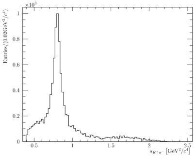

AmpGen is a library and set of applications for fitting and generating multi-body particle decays using the isobar model.
It developed out of the MINT project used in the fitting of three and four-body pseudoscalar decays by the CLEO-c and LHCb colloborations. 

Source code is dynamically generated by a custom engine, JIT compiled and dynamically linked to the user programmer at runtime to give high performance and flexible evaluation of amplitudes. 

## Installation

### Getting the source
* Clone with git
```
git clone http://gitlab.com/tevans1260/AmpGen.git --recursive
```
There is at the time of writing only a master branch (FIXME)

### Build requirements
* cmake >= 3.11.0 
* C++ compiler with CXX standard >= 14 (gcc >= 4.9.3, clang ~ 5). 
  Defaults to Cxx17 (enable cxx14 with cmake flag `-DCMAKE_CXX_STANDARD=14` )
* ROOT >= 6 with MathMore
  To (re)configure root with these options, use the additional command line options `-Dcxx14 -Dmathmore=ON` when configuring the installation of ROOT. 

Optional:
* boost >= 1.67.0 for unit tests 
* xROOTd for network file access 
* OpenMP for multithreading
* ROOT >= 6 with MathMore and Minuit2 enabled. The external version of Minuit2 provied as an external package of GooFit is used if the ROOT version is not unavailable. 
  To (re)configure root with these options, use the additional command line options `-Dcxx14 -Dminuit2=ON -Dmathmore=ON` when configuring the installation of ROOT. 

### Building
The configuration of the AmpGen build is performed by cmake. 
It is recommended to use a build directory to keep the source tree clean. 

```shell
mkdir build
cd build
cmake ..
make
```
This will build the shared library, several standalone test applications, and a set of unit tests. 

### Usage with ROOT

The library can be used interactively in conjunction with the ROOT C++ interpreter by adding the following lines 
to the users root login script 

```
  gSystem->Load("path_to_ampgen/build/lib/libAmpGen.so");
  gROOT->ProcessLine(".include path_to_ampgen");
```

### Advice for other compilers/environments 
#### LLVM

You can also build AmpGen with LLVM. The only change you might want when using Apple LLVM
is to specifically specify the location of the build tool for AmpGen's JIT:

```shell
-DAMPGEN_CXX=$(which c++)
```

#### CentOS7

In order to build stand-alone on CentOS7, you will need a valid development environment; the following line will work:

```shell
lb-run ROOT $SHELL
```

## Getting started

Several examples of usages of the library are included in the apps directory and are 
built alongside the library. 
All standalone programs can accept both options files and command line arguments. 
They also support `--help` to print help for key arguments to the program. 
This will also run the program, as arguments can be defined throughout each of the programs rather than all defined at the beginning. 

### Options files and decay descriptors 

Options files will generally contain the description of one or more particle decays,
as well as other settings such as input/output locations, global flags such as 
whether complex numbers should be interpreted as cartesian or polar, and other parameters 
such as the masses and widths of particles is these differ from those given in the PDG.
 
A minimal example options file for the generator application could contain: 
```
EventType D0 K+ pi- pi- pi+
#                                           Real / Amplitude   | Imaginary / Phase 
#                                           Fix?  Value  Step  | Fix?  Value  Step
D0{K*(892)0{K+,pi-},rho(770)0{pi+,pi-}}     2     1      0       2     0      0   
```
The EventType specifies the initial and final states requested by the user. 
This gives the ordering of particles used in input data, in output code, and used in internal computations. 
This also defines how the amplitude source code must be interfaced with external packages, i.e. MC generators such as EvtGen.

The decay products of a particle are enclosed within curly braces, for example
```
K*(892)0{K+,pi-}
```
describes an excited vector kaon decaying into a charged kaon and pion. 
The other numbers on the lines that describe the decays parameterise the coupling to this channel, 
either in terms of real and imaginary parts or an amplitude and a phase.
Each parameter is specified in terms of three numbers: the _fix_ flag, the initial value, and the step size. 
The possible options for the _fix_ flag are: 
* Free (fix=0) and a step size of not 0.
* Fixed (fix=2, for historical reasons)
* Compile-Time-Constant (fix=3) which indicates that the parameter should be treated as a (JIT) compile time constant, which in some cases allows for more aggressive optimisations to be performed. 

These options can be used in the Generator application, which is described below. 

Decays can either be specified fully inline, as above, or split into multiple steps, which is useful for treating the so called _cascade_ decays, an example of which is shown below.
```
D0{K(1)(1270)+,pi-}                         0     1      0.1       0     0      0.1   

K(1)(1270)+{rho(770)0{pi+,pi-},K+}          2     1      0         2     0      0
K(1)(1270)+{K*(892)0{K+,pi-},pi+}           0     1      0.1       0     0      0.1
```
The production/decay couplings of the K(1270) resonance are now defined in terms of the coupling to the rho(770),K+ channel, 
which can be useful in making comparisons between different production modes of a resonance. 
Additional care must be taken in such a case to not introduce redundant degrees of freedom. 

Configuration can be split over multiple files by the using _Import_ keyword, for example, to import the parameters for the isoscalar K-matrix, the line 
```
Import $AMPGENROOT/options/kMatrix.opt
```
can be added to options file. Multiple user configuration files can also be specified by including multiple files on the command line. 

### Generator

The standalone generator for models can be used as

```shell
Generator MyOpts.opt --nEvents=10000 --Output=output.root
```

Which generates 10000 events of the model described in MyOpts.opt and saves them to output.root. 
The output should include a tree (DalitzEventList) of candidates with the full four-vectors, as well as one- and two-dimensional projections, an example of which is shown below:



In particular, the tree indicates the way in which data is by default loaded into the _Event_ / _EventList_ class. 

### ConvertToSourceCode

This produces source code to evaluate the PDF, and normalises for use with other generators such as EvtGen, i.e. P(max) < 1. This can be used as

```shell
./ConvertToSourceCode MyOpts.opt --sourceFile=MyFile.cpp
```

This can then be a compiled to a shared library using

```shell
g++ -Ofast -shared -rdynamic --std=c++14 -fPIC MyFile.cpp -o MyFile.so
```

<!---
(I broke the python bindings and haven't got round to fixing them yet, hence commented out of the instructions)
You can then check the file by opening it it Python3, using the utility class provided:

```python
from ampgen import FixedLib
lib = FixedLib('MyModel.so')
print(lib.matrix_elements[0]) # Print first matrix element

import pandas as pd
model = pd.read_csv('Input.csv', nrows=100_000)
fcn1 = lib.FCN_all(model)

# or, a bit slower, but just to show flexibility:
fcn2 = model.apply(lib.FCN, axis=1)
```

In this example, I've converted the output to csv to make it easy to import in Python without ROOT present. `.matrix_elements` gives you access to the parts of the PDF, with a `.amp` function that you can feed with P and E (`.vars` holds the current values).
-->

### Fitter
### Debugger
### DataConverter

## Particle Properties and Lineshape parameters
The particles available and their default properties can be found in *options/mass\_width.csv* using the MC format of the 2008 PDG.
Additional pseudoparticles, such as nonresonant states and terms for use in conjunction with K-matrices are defined by *options/MintDalitzSpecialParticles.csv*.
Any additional user defined particles should be added here.
For the default lineshape (the relavistic Breit-Wigner or BW), there are three parameters: The mass, the width and the Blatt-Weisskopf radius. 
These default to their PDG values, but can be overridden in the options file with parameters: *particleName*\_mass, *particleName*\_width, *particleName*\_radius. 
So if the K(1270)+ mass was allowed to vary, the line: 
```
K(1270)+_mass 0 1.270 0.01
```
could be added to the user configuration. 
Other lineshapes may define other parameters, for example channel couplings or pole masses in the case of the K-matrices, which can be set or varied in a similar manner.  

## Fit parameters and expressions

Parameters can either be specified by three parameters, in the case of a scalar parameter such as a mass or a width, or with six parameters in the case of a complex parameter such as a coupling. 
Upper and lower bounds on parameters can also be set by specifying a parameter with five parameters or ten parameters for a scalar or complex, respectively. 
For example, if we wished to vary the K(1)(1270)+ mass in the above example, but restricting the allowed values in the range \[0.0,2.0\] GeV: 
```
K(1)(1270)+_mass 0 1.27 0.01 0.0 2.0
```

(Scalar) parameters can also be related to each other via simple expressions, although the implementation of this is rather unreliable so should be used with caution. 
Suppose for example we have K(1)(1270)+ and K(1)(1270)bar- in the same fit (for example, for D-\>KKpipi) 
The properties of one can be allowed to vary, for example the K(1)(1270)+, and the other fixed to the same value, using:
```
K(1)(1270)+_mass 0 1.27 0.01 0.0 2.0 
K(1)(1270)bar-_mass = K(1)(1270)+_mass 
```
Due to the abundance of **odd** glyphs such as brackets and +/- in parameter names, parameter expressions are white space delimited and somewhat sensitive to bracket usage. 

