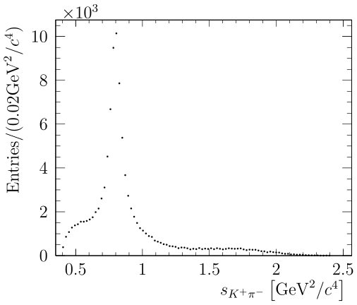
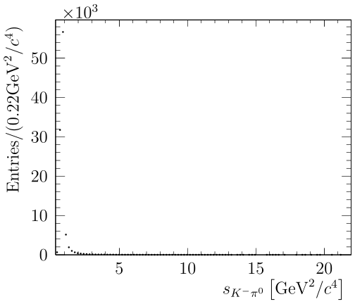
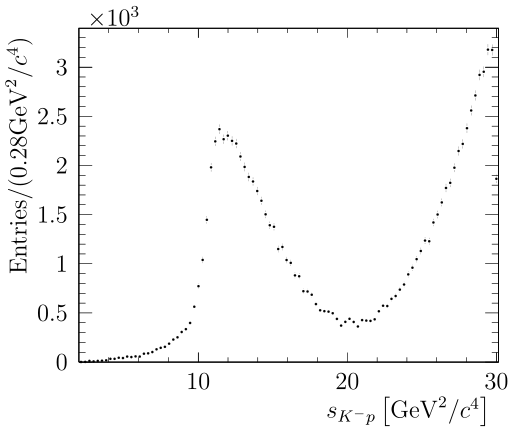
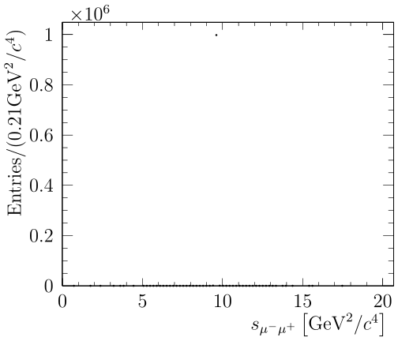
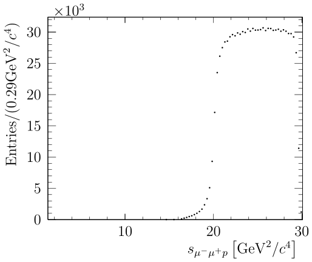

[![Build Status][travis-badge]][travis-link]
[![License: LGPL v3][license-badge]](./LICENSE)

<p align="center">
  
</p>
AmpGen is a library and set of applications for fitting and generating multi-body particle decays using the isobar model.
It developed out of the MINT project used in the fitting of three and four-body pseudoscalar decays by the CLEO-c and LHCb colloborations. The library can handle the fitting and generation of a wide variety of final states, including those involving fermions and photons, as well as polarised initial states.

Source code for the evaluation of amplitudes is dynamically generated by a custom engine, JIT compiled and dynamically linked to the user programme at runtime, which results in high flexibility and performance.

## Table of Contents
* [Getting Started](#getting-started)
* [Applications](#applications)
* [Examples](#examples)
* [Advanced](#advanced)
* [API documentation](https://goofit.github.io/AmpGen/)
* [Acknowledgements](#acknowledgements)

## Getting started
### Installation
#### Getting the source
Clone with git
```
git clone http://github.com/GooFit/AmpGen/ --recursive
```


##### Build requirements:
* cmake >= 3.11.0
* C++ compiler with CXX standard >= 14 (gcc >= 4.9.3, clang ~ 5).
  Defaults to Cxx17 (enable cxx14 with cmake flag `-DCMAKE_CXX_STANDARD=14` )
* ROOT >= 6 with MathMore
  To (re)configure root with these options, use the additional command line options `-Dcxx14 -Dmathmore=ON` when configuring the installation of ROOT.

##### Optional:
* boost >= 1.67.0 for unit tests
* xROOTd for network file access
* OpenMP for multithreading
* ROOT >= 6 with MathMore and Minuit2 enabled. The external version of Minuit2 provided as an external package of GooFit is used if the ROOT version is not unavailable.
  To (re)configure root with these options, use the additional command line options `-Dcxx14 -Dminuit2=ON -Dmathmore=ON` when configuring the installation of ROOT.

#### Building
The configuration of the AmpGen build is performed by cmake.
It is recommended to use a build directory to keep the source tree clean.

```shell
mkdir build
cd build
cmake ..
make 
make install #optional# 
```
This will build the shared library, several standalone test applications, and a set of unit tests. 

#### Usage with ROOT

The library can be used interactively in conjunction with the ROOT C++ interpreter by adding the following lines
to the users root login script

```c++
  gSystem->Load("path_to_ampgen/build/lib/libAmpGen.so");
  gROOT->ProcessLine(".include path_to_ampgen");
```
##### LLVM
You can also build AmpGen with LLVM. The only change you might want when using Apple LLVM
is to specifically specify the location of the build tool for AmpGen's JIT:

```shell
-DAMPGEN_CXX=\$(which c++)
```

##### LXPLUS

A valid development environment is required to build the library on LXPLUS and similar. The easiest way to provide this is via cvmfs views where available, as this provides the necessary versions of gcc in addition to the ROOT libraries in a coherent manner, which can be used as

````
source /cvmfs/sft.cern.ch/lcg/views/setupViews.sh LCG_94python3 x86_64-centos7-gcc8-opt
````

The LCG versions and binary tag may need to be updated over time.

Several examples of usages of the library are included in apps and examples directories and are built alongside the library. All standalone programs can accept both options files and command line arguments. Also supported is the `--help`  option to print instructions for key arguments to the program.

#### Using SIMD instructions.  

AmpGen (v > 2.0) can be setup to generate vectorised code for faster evaluation of amplitudes / computation of integrals on compatible hardware. Such extensions can be enabled by setting the providing the flag 
```
-DUSE_SIMD=AVX2d
```
to cmake. This tells AmpGen that code should be generated using the AVX2 instruction set using double precision. Single precision is also supported, but not recommended for fitting. The support for SIMD instructions is often limited on batch systems, and therefore it is often useful to also have a build with these instruction switched off, which can be done using 

```
-DUSE_SIMD=0
```

### Options files and decay descriptors

Options files will generally contain the description of one or more particle decays, as well as other settings such as input/output locations, global flags such as whether complex numbers should be interpreted as cartesian or polar, and other parameters such as the masses and widths of particles is these differ from those given in the PDG.

A minimal example options file for the generator application could contain:
```
EventType D0 K+ pi- pi- pi+
#                                           Real / Amplitude   | Imaginary / Phase
#                                           Fix?  Value  Step  | Fix?  Value  Step
D0{K*(892)0{K+,pi-},rho(770)0{pi+,pi-}}     2     1      0       2     0      0   
```
The EventType specifies the initial and final states requested by the user. This gives the ordering of particles used in input data, in output code, and used in internal computations. This also defines how the amplitude source code must be interfaced with external packages, i.e. MC generators such as EvtGen.

The decay products of a particle are enclosed within curly braces, for example
```
K*(892)0{K+,pi-}
```
describes an excited vector kaon decaying into a charged kaon and pion. For more details about the API for describing particle decays, see [AmpGen::Particle](https://goofit.github.io/AmpGen/de/dd7/class_amp_gen_1_1_particle.html) The other numbers on the lines that describe the decays parameterise the coupling to this channel,
either in terms of real and imaginary parts or an amplitude and a phase. Each parameter is specified in terms of three numbers: the _fix_ flag, the initial value, and the step size.
The possible options for the _fix_ flag are:

* Free (fix=0) and a step size of not 0.
* Fixed (fix=2, for historical reasons)
* Compile-Time-Constant (fix=3) which indicates that the parameter should be treated as a (JIT) compile time constant, which in some cases allows for more aggressive optimisations to be performed.

These options can be used in the AmpGen application, which is described below.

Decays can either be specified fully inline, as above, or split into multiple steps, which is useful for treating the so called _cascade_ decays, an example of which is shown below.
```
D0{K(1)(1270)+,pi-}                         0     1      0.1       0     0      0.1   
Type
K(1)(1270)+{rho(770)0{pi+,pi-},K+}          2     1      0         2     0      0
K(1)(1270)+{K*(892)0{K+,pi-},pi+}           0     1      0.1       0     0      0.1
```
The production/decay couplings of the $K_1(1270)^+$ resonance are now defined in terms of the coupling to the $\rho(770)^0 K^+$ channel, which can be useful in making comparisons between different production modes of a resonance. Additional care must be taken in such a case so as not to introduce redundant degrees of freedom.

Configuration can be split over multiple files by the using _Import_ keyword, for example, to import the parameters for the parameters associated with the isoscalar K-matrix, the line
```
Import \$AMPGENROOT/options/kMatrix.opt
```

can be added to options file. Multiple user configuration files can also be specified by including multiple files on the command line.

#### PDF Types

AmpGen supports several different types of probability density functions (PDFs), which are detailed in this section. 

#####  CoherentSum 

The most common type of PDF is the CoherentSum. In this case, the total amplitude is given by the sum of amplitudes, weighted by complex coefficients. At a position in the phase space $\mathbf{x}$, the transition amplitude $\mathcal{T}$  is given by:

$\mathcal{T}(\mathbf{x}) = \sum_{k} g_k A_k (\mathbf{x})$

and the corresponding probability density is proportional to $\mathcal{P}(\mathbf{x})\propto \left|\mathcal{T}(\mathbf{x})\right|^2$. The CoherentSum is the default amplitude in many cases, and is used to describe the decay of a single, (pseudo)scalar particle to two or more (pseudo)scalar decay products. 

##### PolarisedSum

The initial and/or final state(s) may also carry spin, in which case the spin states must also be summed. The transition matrix can be written in the isobar model as

$\mathcal{T}_{if} = \sum_k g_k \mathcal{T}^{k}_{if}(\mathbf{x})$,

where $i$ and $f$ label the initial and final states, respectively. As these states are in principal observables, the indices related to spin must be summed incoherently. The probability density function in this case is therefore given by

$\mathcal{P}(\mathbf{x}) = \sum_{if} \hat{\rho}_{ij} T_{if}(\mathbf{x}) T^{*}_{jf}(\mathbf{x})  $,

where $\hat{\rho}$ is the relevant density matrix for the initial state, which is given by 1 for a scalar initial state. For a spin-$\frac{1}{2}$ state, the density matrix can be parameterised in terms of a polarisation vector $p_i$ and the Pauli matrices $\sigma_i$, and is given by: 

$\hat{\rho} = I + \sigma_i p_i$ 

For a spin-1 initial state, the density matrix is parameterised in terms of the Gell-Mann matrices, $\lambda_k$,  as 

$\hat{\rho} = I + \lambda_k p_k$,

where now the polarisation 'vector' $p_k$ has 8 components. 

##### IncoherentSum 

An alternative model is the IncoherentSum, which may be useful to describe the probability density of a background contribution that contains incoherent sources with several different resonances. Generally, such models are only useful for relatively small backgrounds in relatively pure samples, as in general background contributions cannot be described with such a simple parameterisation. In this case, the probability is given by an incoherent sum of amplitudes: 

$\mathcal{P}(\mathbf{x}) = \sum_k g_k^2 \left| A_k \right|^2 $ 

## Applications

This section details the prebuilt command line applications that use the AmpGen library for some common functionality, such as generating Toy Monte Carlo samples and debugging amplitudes.

### Table of contents
* [AmpGen](#AmpGen)
* [Debugger](#debugger)
* [LibDiff](#LibDiff)
* [DataConverter](#DataConverter)

### AmpGen

The standalone generator (named AmpGen) is used as: 

```shell
AmpGen.exe MyOpts.opt --nEvents=10000 --Output=output.root
```

where MyOpts.opt contains the options described in the previous section that describe the decay the user wishes to generate, and the optional arguments `nEvents` and `Output` given the number of events requested and the output file, respectively. The full list of application specific arguments can be obtained by: 

```bash
AmpGen.exe --help 
```

The output includes a tree (DalitzEventList) of candidates with the full four-vectors, as well as one- and two-dimensional projections, an example of which is shown below:

<p align="center">
  
</p>


Several models for different $D^0$ decays published by the LHCb collaboration are included in the options directory, in addition to several other decay modes to demonstrate different features. These options often do not include EventTypes so as they can be included as part of a larger decay chain if required. For example, to generate $10^6$ toy $\Dz\to\Km\pip\pip\pim$ decays, the type of the events requested must also be specified: 

```shell
AmpGen.exe options/D02Kpipipi.opt --EventType "D0 K- pi+ pi+ pi-" --nEvents 1000000
```

The standalone generator can also be used to only produce the source code that evaluates the amplitude, to be used by other generators such as EvtGen. In this case, the PDF is automatically normalised such that $\mathcal{P}_{\text{max}} < 1$ . The code can be generated and compiled into a shared library as follows
```shell
AmpGen.exe MyOpts.opt --Output=MyModel.cpp --SourceOnly
g++ -Ofast -shared -rdynamic --std=c++14 -fPIC MyModel.cpp -o MyModel.so
```
Decays can also be specified entirely on the command line in order to quickly study the distributions of different decay modes. For example, to generate a sample of 10000  $\Lambda_b \to p K^{*-}$  decays, 

```shell
AmpGen.exe --Decay "Lambda(b)0{p+,K*(892)bar-{K-,pi0}}" --nEvents 10000 --Type PolarisedSum 
```

The flag `Type` is used to specify that the initial and/or final states includes at least one particle carrying spin, and thus polarisation must be taken into account. The output is both the full event kinematics, as well as projections of the different invariant masses shown below:

<p align="center">
<div>


</div>
</p>


#### Phase space generators

Generating events consists of two phases. Firstly, the kinematics of candidates are generated according to some distribution, by default uniform in the phase space.  The target distribution, $\mathcal{P}(\mathbf{x})$ , is then obtained using the accept-reject method. A candidate generated at position $\mathbf{x}$ in the phase space is retained on the condition that 

 $\mathcal{P}(\mathbf{x}) > \mathcal{P}_{\text{max}} \times \texttt{Uniform}(0,1) $,

where $\mathcal{P}_{\text{max}}$ is the largest possible value of $\mathcal{P}(\mathbf{x})$ , and $\texttt{Uniform}(0,1)$ is a random number uniformly drawn between 0 and 1. 

​	The generation can be made more efficient by making the first step produce candidates that are distributed more closely to the full distribution than the uniform phase space. In particular, this is relevant for producing very narrow structures such as the $J/\psi$ resonance efficiently. To use this option, the flag `PhaseSpace` should be set to the value `TreePhaseSpace`. For example, to generate a sample of $10^6$  $\Lambda_b^0 \to J/\psi \left[\mu^+\mu^-\right]\Lambda(1405)^0 \left[p^+ \pi^-\right]$ decays: 

```shell
AmpGen.exe --Decay "Lambda(b)0{J/psi0{mu+,mu-},Lambda(1405)0{p+,pi-}}" --nEvents 1000000 --Type PolarisedSum --PhaseSpace TreePhaseSpace
```

Two example projections are shown below, of the dimuon invariant mass with essentially no width, which would be virtually impossible to generate with a uniform distribution and the naive accept-reject method, and the combined mass of the dimuon with the proton from the $\Lambda(1405)^0$ decay:

<p align="center">
<div>


</div>
</p>


### Debugger 

The debugger application is a tool for producing verbose information debugging for amplitudes and models. It is used on an options file as

```
Debugger.exe MyOpts.opt
```
which calculates each amplitude at a randomly generated point in phase space, as well as calculating the total amplitude accounting for complex couplings. 

A more useful application is the _verbose_ debugging mode which can be activated by

```
Debugger.exe MyOpts.opt --CoherentSum::Debug
```
which produces a large number of intermediate steps in the calculation of each amplitude, which are added to the calculation using the ADD_DEBUG and ADD_DEBUG_TENSOR macros in the code generation. For example, in src/Lineshapes/BW.cpp.
If the model is a PolarisedSum, i.e. handles spin in the initial/final state, the flag PolarisedSum::Debug should be used instead of CoherentSum::Debug.

### LibDiff 

### DataConvertor

## Examples

### SignalOnlyFitter

An example fitter is provided in _examples/SignalOnlyFitter.cpp_, which as the name suggests only has a single signal component in the fit. The free parameters of the fit are specified in the same way as the Generator, with the additional relevant slots being _DataSample_ which specifies the signal sample to fit, which is presumed to already have the selection applied, and _Branches_ which takes a list of branch names, and defaults to the format used by the Generator. More details can be found with
```shell
SignalOnlyFitter.exe --help
```
For example, the fitter can be used to fit a toy MC sample generated by the generator by running:
```shell
AmpGen.exe MyOpts.opt --nEvents 100000
SignalOnlyFitter.exe MyOpts.opt --DataSample Generate_Output.root
```

## Advanced

This section contains miscellaneous details on more advanced functionality, including using python bindings and alternative parameterisations of the spin factors.

### Table of contents
* [Python Bindings](#python-bindings)
* [Particle Properties and Lineshape parameters](#particle-properties-and-lineshape-parameters)
* [Fit parameters and expressions](#fit-parameters-and-expressions)
* [Spin Formalisms](#spin-formalisms)
* [Quasiparticles](#quasiparticles)

### Python Bindings
Models built into a shared library can be used in python using the following flags into ConvertToSourceCode:
```shell
./AmpGen.exe MyOpts.opt --Output=MyFile.cpp --SourceOnly --OutputEvents=events.csv --IncludePythonBindings
```
where normalisation events are also output for testing purposes in events.csv.
This can then be used with the python bindings in ampgen.py:  
```python
from ampgen import FixedLib
model = FixedLib('MyModel.so')
print(model.matrix_elements[0]) # Print first matrix element

import pandas as pd
data = pd.read_csv('events.csv', nrows=100_000)
fcn1 = model.FCN_all(data)

# or, a bit slower, but just to show flexibility:
fcn2 = data.apply(model.FCN, axis=1)
```

### Particle Properties and Lineshape parameters
The particles available and their default properties can be found in *options/mass\_width.csv* using the MC format of the 2008 PDG. Additional pseudoparticles, such as nonresonant states and terms for use in conjunction with K-matrices are defined by *options/MintDalitzSpecialParticles.csv*. Any additional user defined particles should be added here. For the default lineshape (the relavistic Breit-Wigner or BW), there are three parameters: The mass, the width and the Blatt-Weisskopf radius. These default to their PDG values, but can be overridden in the options file with parameters: *particleName*\_mass, *particleName*\_width, *particleName*\_radius. To vary the mass of the  $K_1(1270)^+$ meson, the line:
```
K(1)(1270)+_mass 0 1.270 0.01
```
could be added to the user configuration.
Other lineshapes may define other parameters, for example channel couplings or pole masses in the case of the K-matrices, can be set or varied in a similar manner.

### Fit parameters and expressions

Parameters can either be specified by three parameters, in the case of a scalar parameter such as a mass or a width, or with six parameters in the case of a complex parameter such as a coupling.
Upper and lower bounds on parameters can also be set by specifying a parameter with five parameters or ten parameters for a scalar or complex, respectively.
For example, if we wished to vary the mass of the $K_1(1270)^+$ meson in the above example, but restricting the allowed values in the range $[0.0,2.0]\,\mathrm{GeV}$:
```
K(1)(1270)+_mass 0 1.27 0.01 0.0 2.0
```

Parameters can also be related to each other via expressions,
Suppose for example we have $K_1(1270)^+$ and $K_1(1270)^-$ in the same fit (for example, in $D^0 \to K^- K^+ \pi^- \pi^+$)
The properties of one can be allowed to vary, for example the $K_1(1270)^+$, and the other fixed to the same value, using:
```
K(1)(1270)+_mass 0 1.27 0.01 0.0 2.0
K(1)(1270)bar-_mass = K(1)(1270)+_mass
```
Parameter expressions are whitespace delimited due to the abundance of **odd** glyphs such as brackets and +/- in the names of parameters.
Expressions support the binary operations $(+,-,/,* )$, as well as common unary functions such as sqrt, trigonometric functions etc.

### Spin Formalisms

AmpGen implements both the covariant tensor (or Rarita-Schwinger) and canonical helicity formalism for describing the angular momentum component of decays.
Both formalisms refer to states of well-defined orbital angular momentum, as opposed to the helicity states, as the states with well-defined orbital angular momentum have a straightforward parity and momentum dependences.
The default formalism is the covariant tensor formalism, but this can be switched to the canonical formalism changing the flag
```
Particle::SpinFormalism Canonical
```
in the options file.
The spin formalism for an individual decay chain can be specified by changing the attribute SpinFormalism in the decay descriptor. For example,
```
D0[SpinFormalism=Canonical]{K*(892)bar0,rho(770)0}
```
selects the S-wave of the $K^* \rho$ system. The user can also specify systems of helicity couplings in the canonical formalism, using the attribute _helAmp_. For example, suppose the transversity amplitudes were used rather than the canonical, then the user can specify
```
D0[SpinFormalism=Canonical;helAmp=Long]{K*(892)bar0,rho(770)0}
D0[SpinFormalism=Canonical;helAmp=t1]{K*(892)bar0,rho(770)0}
D0[SpinFormalism=Canonical;helAmp=t2]{K*(892)bar0,rho(770)0}
```
For the longitudinal and two transverse amplitudes. These must then be defined by the user in terms of the helicity amplitudes in the following structure:
```
Long {
  1.0 0 0
}

t1 {
  0.707106781 +1 +1
  0.707106781 -1 -1
}

t2 {
   0.707106781 +1 +1
  -0.707106781 -1 -1
}
```
That is specified as sets of three numbers, firstly the coupling, and then the two particle helicities. So in this example, the longitudinal amplitude is the $00$ helicity state, while the two transverse amplitudes and the sum and difference of the two other helicity amplitudes.

### Quasiparticles

Quasiparticles are fictional decaying particles that can be implemented in the decay chain for a variety of different purposes. The original use case was to group some amplitudes with the same quantum numbers with couplings that want to be factorised. 
For example, for the $I=0$ $S$-wave, the K matrix description may be used. The coupling from the initial state may be written as 

```
D0{K0S0,NonResS0} ...
```
The quasiparticle _NonResS0_ can then be decayed to the final state via the K matrix lineshape(s) 
```
NonResS0[kMatrix.pole.0]{pi+,pi-} ...
NonResS0[kMatrix.pole.1]{pi+,pi-} ...
...
```
where each of the .X is one of the terms of the (pole) production vector. 
In this example, an equivalent formulation would be 
```
D0{K0S0,NonResS0[kMatrix.pole.0]{pi+,pi-}} ...
D0{K0S0,NonResS0[kMatrix.pole.1]{pi+,pi-}} ...
...
```

## Acknowledgements
The development of this software has been  supported by the National Science Foundation under grant PHY-1414736 and through a subcontract under Cooperative Agreement OAC-1836650.   Any opinions, findings, and conclusions or recommendations expressed in this material are those of the developers and do not necessarily reflect the views of the National Science Foundation.

<p align="center">
  <div>
  
  
  
  </div>
</p>

[travis-badge]:      https://travis-ci.org/GooFit/AmpGen.svg?branch=master
[license-badge]:     https://img.shields.io/badge/License-GPL%20v2-blue.svg
[travis-link]:       https://travis-ci.org/GooFit/AmpGen
